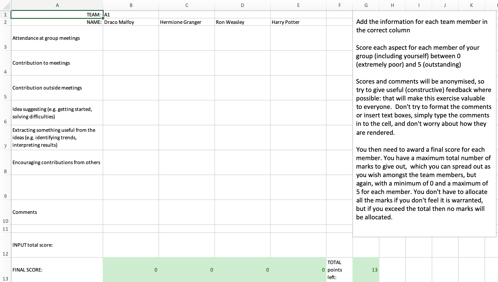
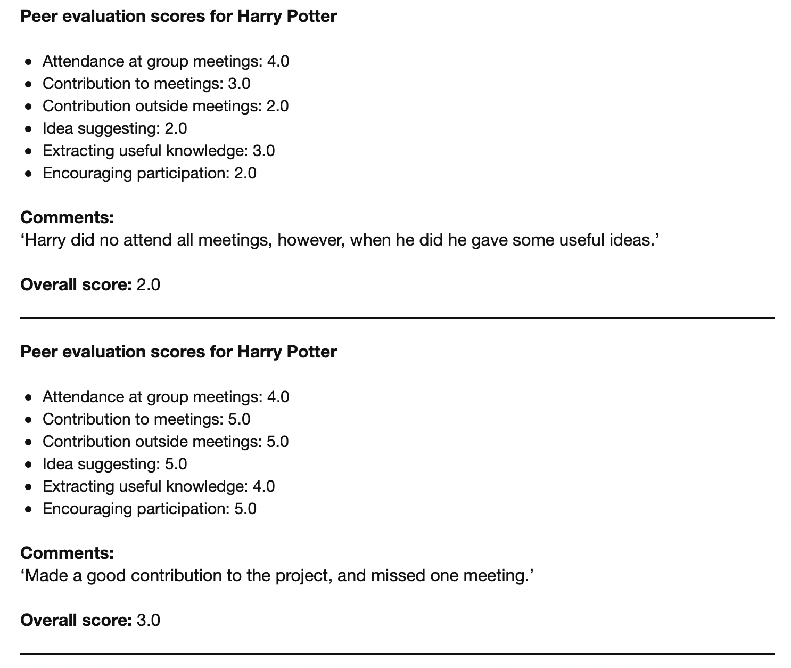

PeerMark
========

The PeerMark package facilitates scalable peer marking assessment for group work
exercises. There are two main utilities: generating the marking spreadsheets for
distribution to the students, and extracting the data (feedback and marks) they
assign to their team mates. The package is written in Python 3.7.

Screenshots
-----------

### Generated Spreadsheet

### Harvested Feedback

Dependencies
------------

Specific library requirements are

* xlsxwriter
* xlrd
* pypandoc

the last of which is required only if PDF feedback files are required. For
pypandoc to render the PDF documents, a system installation of LaTeX is
required. The python packages can be installed by executing 

    pip install pypandoc

or
    conda install pypandoc

(or whatever package installer you use for python).

There are several ways to install LaTeX.

* you can download [MacTex](http://www.tug.org/mactex/downloading.html) 
* you can use macports `sudo port install latex`
* you can find, download and instal another LaTeX package online

If pypandoc and LaTeX are not installed, you can still execute the program to
extract the peer review marks, and the feedback will be saved in markdown
format, which can be viewed as plain text if necessary. 

Setup
---------

In order to generate the spreadsheets, you will need

* A list of your students in csv format (can be output from a spreadsheet for
   instance).

The student csv file should be in the format [Full Name], [Team Number],
[Student ID]. E.G:

    Harry Potter,A1,40204635
    Hermione Granger,A1,40174358
    Ron Weasley,A1,40196189
    Draco Malfoy,A1,40197913
    Percy Weasley,A2,40204564
    Penelope Clearwater,A2,40203899
    Lee Jordan,A2,40205211
    Lavender Brown,A2,40199802

In principle you could simply number your teams A1-A100 (or however many you
need), but you can also add subgroups, e.g. A1-A10, B1-B10, C1-C10, in order to
break up the teams by tutorial group, computer class, etc.

* The template spreadsheet

A template is provided in the templates/ directory. You can change the questions
the students answer, but should not change the number of questions (yet, unless you
want to dig around in the code to account for that change). 

* The instructions you want your students to follow. 

The instructions will appear in a text box in the spreadsheet the student sees.
A sample set of instructions is given in the templates/ directory. 

You can edit the templates provided, or, if you prefer, use different files for
you templates, which requires you to change the header information in the python
scripts so that the templates point to the correct files. 

